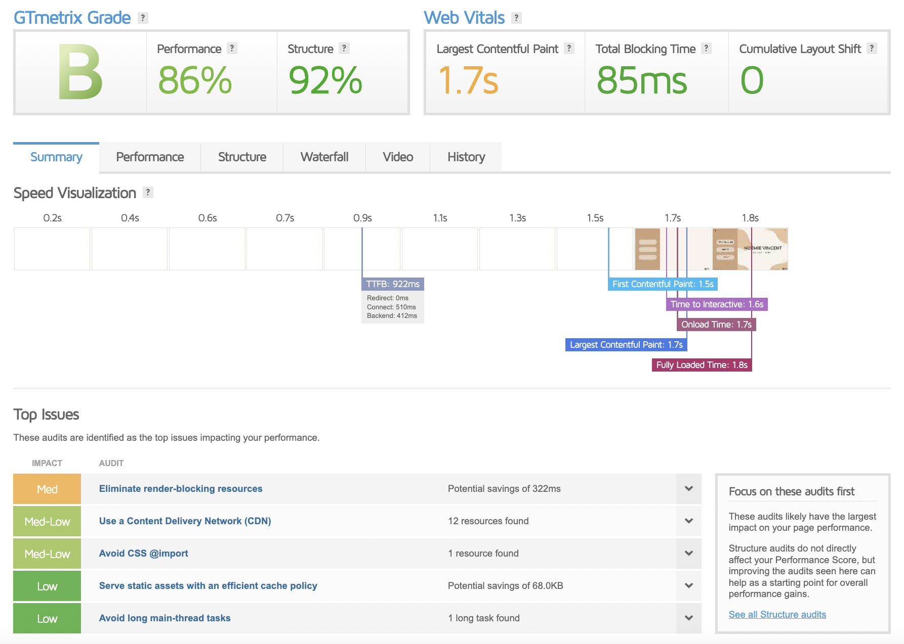
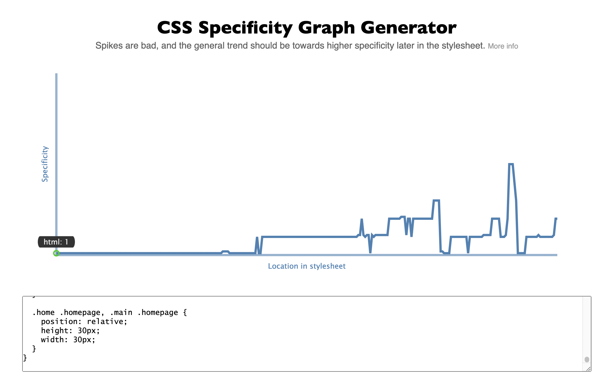
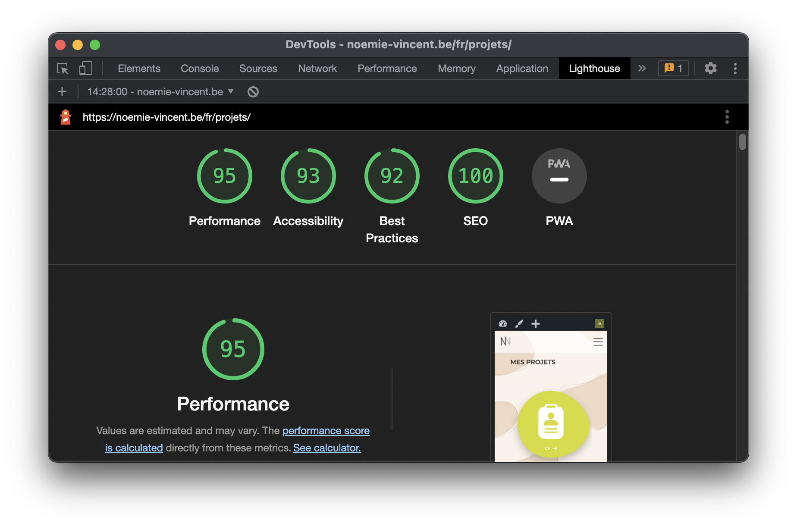

# Portfolio

> lien vers le [site](https://noemie-vincent.be/fr/)

## PUBLIC CIBLE

> voir les [personas et parcours utilisateurs](/readme-img/personas&parcours.pdf)

#### TRANCHE D'ÂGE

- 18 - 70 ans

#### STATUT SOCIOPROFESSIONNEL

- employeurs potentiels
- clients potentiels
- futurs web designer
- étudiants qui cherchent de l'inspiration
- collègues (autres web designer)
- professeurs
- *que cherchent-ils ?*

#### EXPÉRIENCE DE L'INFORMATIQUE ET D'INTERNET

- peut varier d'une utilisation occasionnelle à quotidienne

#### CONFIGURATION DU MATÉRIEL UTILISÉ

- adapté à tous les supports aussi bien du côté esthétique qu'accessible

----------------------------------------

## PROTOTYPAGE
> voir le [wireframe](https://www.figma.com/file/OTvoSPafjqMoZbjj0xrN3s/Antilope?node-id=0%3A1) et le [design](https://www.figma.com/file/CWqutSiFXm1OEDfcrmsMdy/Portfolio?node-id=51%3A2) (figma)

> voir le [moodboard](/readme-img/moodboard.pdf)

#### OBJECTIFS

- prendre contact
- découvrir qui je suis
- voir mes projets

#### INFORMATIONS REÇUES

- qui je suis
- parcours
- identité graphique
- professionnalisme (qualité du site, compétences dans la réalisation d'un site)
- infos de contact
- réseaux

#### PAGES

- accueil
- projets
- projet individuel
- à propos
- contact

----------------------------------------

## TEST D'ACCESSIBILITÉS
#### GTMetrix

#### CSS Specificity graph generator

#### Lighthouse

